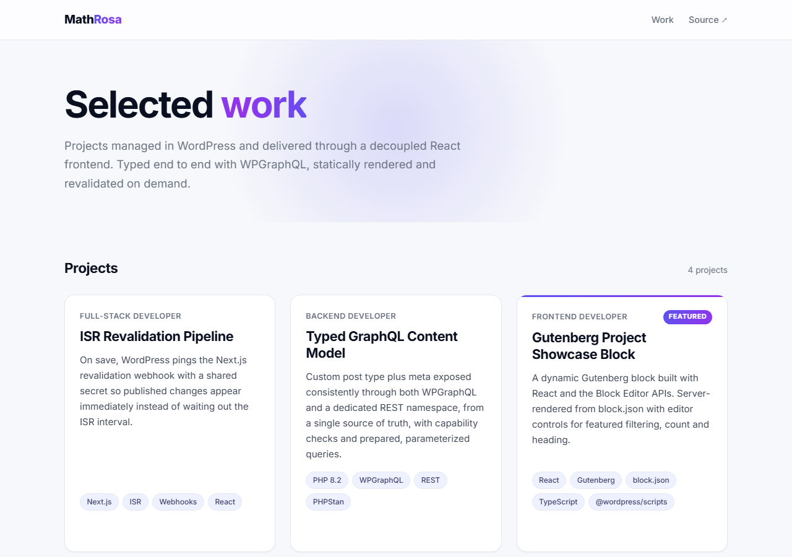
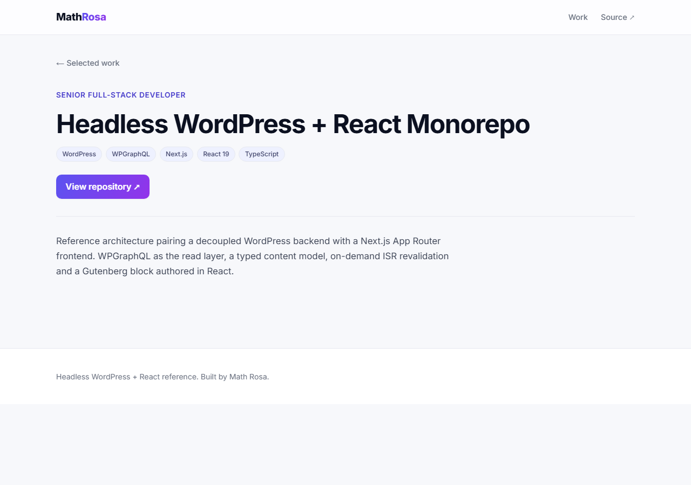
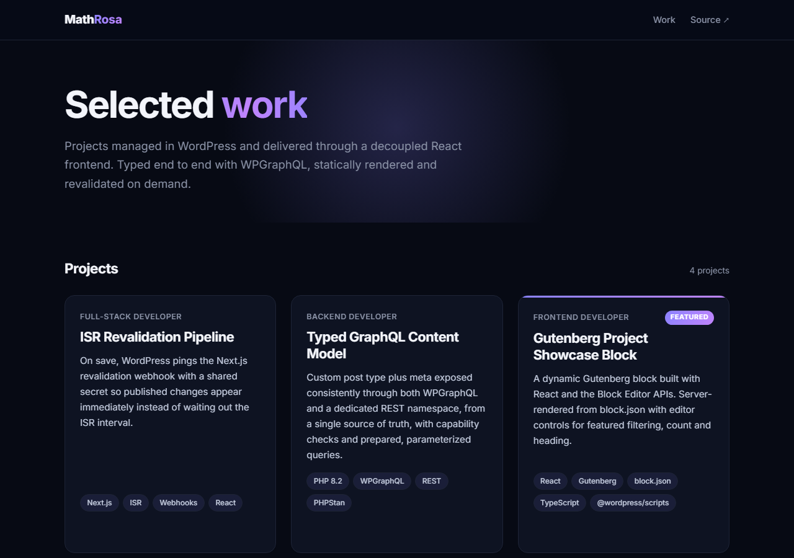
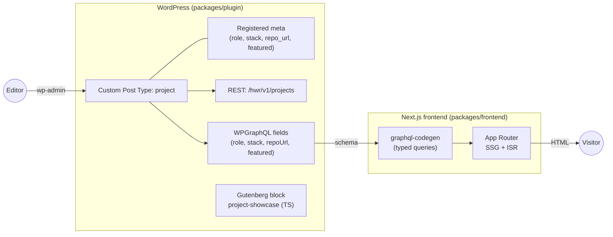

# Headless WordPress + React

[](https://github.com/naynieb/headless-wp-react/actions/workflows/ci.yml)

A production shaped reference monorepo that decouples **WordPress** (content, editing, API) from a **React / Next.js** frontend. It is intentionally small in scope but complete in engineering practice: a custom plugin, a custom post type, REST and WPGraphQL surfaces, Gutenberg blocks authored in TypeScript, a typed GraphQL frontend, tests on both sides, CI, and documented architecture decisions.

The domain is a **project portfolio**. Editors manage `Project` entries in wp-admin, and the Next.js app renders them statically with incremental revalidation.

## Screenshots

|                              Home                               |                                 Project detail                                  |
| :-------------------------------------------------------------: | :-----------------------------------------------------------------------------: |
| [](docs/screenshots/home.png) | [](docs/screenshots/project.png) |

The frontend adapts to the reader's system theme (dark mode shown):

[](docs/screenshots/home-dark.png)

## Contents

- [Screenshots](#screenshots)
- [Highlights](#highlights)
- [Architecture](#architecture)
- [Tech stack](#tech-stack)
- [Repository layout](#repository-layout)
- [Prerequisites](#prerequisites)
- [Quickstart](#quickstart)
- [Scripts](#scripts)
- [Environment variables](#environment-variables)
- [Testing](#testing)
- [Continuous integration](#continuous-integration)
- [Security posture](#security-posture)
- [Deployment](#deployment)
- [Architecture decisions](#architecture-decisions)
- [License](#license)

## Highlights

- **Decoupled by design.** WordPress serves only wp-admin and an API. The public site is a separate Next.js app.
- **One content model, two APIs.** Project fields are defined once and exposed through both WPGraphQL and a custom REST namespace, so the surfaces cannot drift.
- **Contract-checked GraphQL.** The frontend's WPGraphQL queries are validated against the live schema in CI via `graphql-codegen`; the app uses hand-authored types kept in sync with that schema.
- **Blocks in TypeScript.** The `project-showcase` Gutenberg block uses `block.json` (API v3) and renders dynamically in PHP.
- **Editing in React.** A native Gutenberg document-sidebar panel (with optional ACF) edits the project fields; the choice is recorded in ADR 0008.
- **Draft preview, end to end.** A signed "Preview" link opens an unpublished draft on the React frontend through Next.js draft mode and an authenticated read.
- **Tested on both sides.** PHPUnit for the plugin, Vitest for units, Playwright for end to end.
- **Secure by default.** Per-post capability checks, dedicated capabilities, a restrictive CORS policy, HMAC-signed preview tokens, per-IP rate-limited webhooks, baseline security headers, no raw SQL, and debug output off outside development.

## Architecture



Content is authored in WordPress and never rendered by its theme. The Next.js app reads it over WPGraphQL at build time and revalidates on an interval, so visitors are served static HTML and CDN assets. The rationale and trade-offs are documented in [docs/ARCHITECTURE.md](docs/ARCHITECTURE.md) and the [architecture decisions](#architecture-decisions).

## Tech stack

| Layer          | Choice                                                                                                            |
| -------------- | ----------------------------------------------------------------------------------------------------------------- |
| CMS / API      | WordPress 6.8, PHP 8.2, custom plugin (namespaced, PSR-4)                                                         |
| Data access    | WPGraphQL (primary) and a custom REST namespace (`hwr/v1`)                                                        |
| Editing        | Gutenberg block plus a React document-sidebar panel (`@wordpress/scripts`, `block.json` API v3, TS); optional ACF |
| Frontend       | Next.js (App Router), React, TypeScript                                                                           |
| GraphQL typing | `graphql-codegen`, validated against the live schema in CI                                                        |
| Observability  | Sentry (opt-in) for server-side error monitoring                                                                  |
| Local env      | `@wordpress/env` (Docker), one command to boot WP and plugins                                                     |
| Tests          | PHPUnit (plugin), Vitest (units), Playwright (e2e)                                                                |
| Quality        | PHPCS (WordPress Coding Standards), PHPStan, ESLint, Prettier                                                     |
| CI             | GitHub Actions: PHP, JS, GraphQL contract, and integration jobs                                                   |

## Repository layout

```
headless-wp-react/
├── packages/
│   ├── plugin/            # WordPress plugin (PHP + TS blocks)
│   │   ├── headless-portfolio.php   # bootstrap: autoload, activation, boot
│   │   ├── includes/                # PSR-4 classes (Hwr\Portfolio)
│   │   │   ├── Plugin.php            # wires features to hooks
│   │   │   ├── PostType/             # the project CPT and permalinks
│   │   │   ├── Meta/                 # single source of truth for fields
│   │   │   ├── Rest/                 # hwr/v1 controller (read, guarded write, preview)
│   │   │   ├── GraphQL/              # WPGraphQL field registration
│   │   │   ├── Blocks/               # block registrar
│   │   │   ├── Editor/               # native React editing panel (enqueue)
│   │   │   ├── Acf/                  # optional ACF field group
│   │   │   ├── Preview.php           # signed draft-preview links
│   │   │   ├── FrontendRedirect.php  # send the WP front-end to Next
│   │   │   ├── Revalidator.php       # ping the frontend on save
│   │   │   ├── Capabilities.php      # dedicated project capabilities
│   │   │   ├── Cors.php              # restrictive CORS policy
│   │   │   └── I18n.php              # text domain loading
│   │   ├── src/blocks/               # Gutenberg block source (TypeScript)
│   │   ├── src/editor/               # React editing-panel source (TypeScript)
│   │   ├── build/                    # compiled blocks and panel (generated)
│   │   ├── tools/dev-mu-plugins/     # local-only demo seed
│   │   ├── tests/                    # PHPUnit
│   │   └── uninstall.php             # cleanup on delete
│   └── frontend/          # Next.js app (App Router, TS)
│       ├── app/           # pages, api/revalidate, api/draft, sitemap, robots
│       ├── components/    # ProjectCard, StackList, PreviewBanner
│       ├── lib/           # env, data access, GraphQL client, preview, rate limiting
│       ├── instrumentation.ts    # Sentry (opt-in)
│       └── tests/         # Vitest + Playwright
├── docs/                  # architecture and decisions (ADRs)
├── .wp-env.json           # local WordPress environment
└── .github/workflows/     # CI
```

Each package has its own README with the details that matter for that side: [packages/plugin/README.md](packages/plugin/README.md) and [packages/frontend/README.md](packages/frontend/README.md).

## Prerequisites

- **Node 22+** and **pnpm 9+**
- **Docker** (for `@wordpress/env`)
- **PHP 8.2+** and **Composer** (for the plugin's PHP dependencies and tests)

## Quickstart

```bash
# 1. Install JS dependencies across the workspace
pnpm install

# 2. Install PHP dependencies for the plugin
pnpm --filter @hwr/plugin composer:install

# 3. Boot WordPress, WPGraphQL, and this plugin (Docker)
pnpm env:start          # WordPress at http://localhost:8888 (admin/password)

# 4. Generate typed GraphQL and run the frontend
pnpm codegen
pnpm dev                # Next.js at http://localhost:3000
```

The local environment auto seeds a few demo `Project` entries on first boot (see `packages/plugin/tools/dev-mu-plugins/hwr-demo-seed.php`), so the frontend has data immediately. Manage projects in wp-admin under **Projects**.

## Scripts

Run from the repository root.

| Script              | Purpose                                     |
| ------------------- | ------------------------------------------- |
| `pnpm env:start`    | Boot the local WordPress environment        |
| `pnpm env:stop`     | Stop the environment                        |
| `pnpm env:destroy`  | Remove the environment and its data         |
| `pnpm dev`          | Run the Next.js dev server                  |
| `pnpm build`        | Build every package                         |
| `pnpm test`         | Run unit tests across the workspace         |
| `pnpm test:e2e`     | Run Playwright end to end tests             |
| `pnpm codegen`      | Generate typed GraphQL from the live schema |
| `pnpm lint`         | Lint every package                          |
| `pnpm typecheck`    | Type-check every package                    |
| `pnpm format`       | Format the repository with Prettier         |
| `pnpm format:check` | Check formatting without writing            |

## Environment variables

Copy `packages/frontend/.env.example` to `packages/frontend/.env.local`. The localhost defaults suit local development; real deployments must set the public variables explicitly.

**Frontend** (`packages/frontend/.env.local`):

| Variable                          | Purpose                                                                               |
| --------------------------------- | ------------------------------------------------------------------------------------- |
| `NEXT_PUBLIC_WORDPRESS_URL`       | WordPress base URL (admin links, image host allowlisting)                             |
| `NEXT_PUBLIC_GRAPHQL_ENDPOINT`    | WPGraphQL endpoint the frontend queries                                               |
| `NEXT_PUBLIC_SITE_URL`            | Public URL of the frontend, for canonical, Open Graph and sitemap URLs                |
| `REVALIDATE_SECONDS`              | ISR revalidation interval, in seconds                                                 |
| `REVALIDATE_SECRET`               | Shared secret for the revalidation webhook (must match the plugin)                    |
| `WP_PREVIEW_SECRET`               | Shared secret to verify preview tokens (must match the plugin); enables draft preview |
| `WP_APP_USER` / `WP_APP_PASSWORD` | WordPress Application Password for the authenticated draft read                       |
| `SENTRY_DSN`                      | Optional. Server-side error monitoring; inert when unset                              |

**WordPress plugin constants** (in `wp-config.php` or `.wp-env.json`, all optional):

| Constant                | Purpose                                                                                                     |
| ----------------------- | ----------------------------------------------------------------------------------------------------------- |
| `HWR_FRONTEND_URL`      | Frontend base URL; rewrites project permalinks and preview links there, and allowlists that origin for CORS |
| `HWR_REVALIDATE_SECRET` | Shared secret sent to the revalidation webhook (must match `REVALIDATE_SECRET`)                             |
| `HWR_PREVIEW_SECRET`    | Shared secret used to sign preview links (must match `WP_PREVIEW_SECRET`); enables the "Preview" flow       |

### Testing draft preview

1. On WordPress, set `HWR_FRONTEND_URL` and `HWR_PREVIEW_SECRET`, and create an Application Password (wp-admin, Users, Profile, Application Passwords).
2. On the frontend, set `NEXT_PUBLIC_SITE_URL`, `WP_PREVIEW_SECRET` (the same value as `HWR_PREVIEW_SECRET`), `WP_APP_USER` and `WP_APP_PASSWORD`.
3. Edit a project in wp-admin, keep it a draft, and click **Preview**.
4. The frontend opens the draft with a "Preview mode" banner; **Exit preview** returns to published content. In production, draft mode uses `Secure` cookies, so a production frontend must be served over HTTPS; local development over HTTP works.

## Testing

```bash
pnpm test                              # Vitest units (frontend)
pnpm test:e2e                          # Playwright (needs WordPress running)
pnpm --filter @hwr/plugin composer:install
```

PHP tests use the WordPress test framework and run through `wp-env`:

```bash
pnpm env:start
wp-env run tests-cli --env-cwd=wp-content/plugins/plugin ./vendor/bin/phpunit
```

## Continuous integration

GitHub Actions runs four jobs in [.github/workflows/ci.yml](.github/workflows/ci.yml):

- **php**: PHPCS (WordPress Coding Standards) and PHPStan.
- **js**: production dependency audit (`pnpm audit --prod --audit-level=high`), Prettier, ESLint, TypeScript, Vitest, and the production build.
- **graphql-contract**: boots WordPress and runs `graphql-codegen` against the live schema, so a query that references a field the schema no longer exposes fails the build.
- **integration**: boots WordPress once with wp-env, then runs PHPUnit against the plugin (including the REST controller) and Playwright against the built frontend on that same environment.

## Security posture

- **Authorization is server-side.** Writes and the draft-preview read check the `edit_post` capability for the specific project; the frontend is never trusted.
- **Dedicated capabilities.** The CPT uses `capability_type` and `map_meta_cap`, and only administrator and editor roles receive the project capabilities.
- **Signed preview links.** Preview URLs carry an HMAC-SHA256 token over the post id, slug and a short expiry; the frontend verifies it in constant time, and the draft id in the cookie is signed and bound to the slug it authorized.
- **Rate-limited webhooks.** `/api/revalidate` and `/api/draft` are rate limited per client IP and return `429` with `Retry-After`; secrets are compared in constant time.
- **Secrets stay server-side.** Preview and revalidation secrets and the Application Password are non-public env vars; only URLs are exposed to the client.
- **Baseline security headers.** `X-Content-Type-Options`, `X-Frame-Options: DENY`, `Referrer-Policy` and `Permissions-Policy` on every response.
- **Restrictive CORS.** `Access-Control-Allow-Origin` is sent only for an allowlisted origin, and credentials are off by default.
- **No raw SQL.** All access goes through WordPress query APIs, enforced by PHPCS database sniffs.
- **Debug output is disabled** outside local and development environments.

See [docs/ARCHITECTURE.md](docs/ARCHITECTURE.md) for details.

## Deployment

- **WordPress** deploys to any managed host or container. Only wp-admin and the API are public.
- **Frontend** deploys to a static or Node host such as Vercel or Netlify. On save, the plugin's `Revalidator` calls `POST /api/revalidate` with the shared secret to revalidate on demand; set `HWR_REVALIDATE_SECRET` (WordPress) to match `REVALIDATE_SECRET` (frontend).

## Architecture decisions

- [0001 Headless architecture](docs/decisions/0001-headless-architecture.md)
- [0002 WPGraphQL primary, REST secondary](docs/decisions/0002-wpgraphql-primary-rest-secondary.md)
- [0003 Define the content model once](docs/decisions/0003-register-meta-once.md)
- [0004 TypeScript blocks with block.json v3](docs/decisions/0004-typescript-blocks-blockjson-v3.md)
- [0005 The project CPT is not rendered by WordPress](docs/decisions/0005-cpt-not-publicly-rendered.md)
- [0006 Dedicated project capabilities](docs/decisions/0006-dedicated-project-capabilities.md)
- [0007 Restrictive CORS](docs/decisions/0007-restrictive-cors.md)
- [0008 Project editing surfaces (React panel default, ACF optional)](docs/decisions/0008-editing-surfaces.md)
- [0009 Draft preview via signed links and an authenticated read](docs/decisions/0009-draft-preview.md)
- [0010 Redirect the WordPress front-end to the React app](docs/decisions/0010-headless-frontend-redirect.md)

## License

MIT. See [LICENSE](LICENSE).
