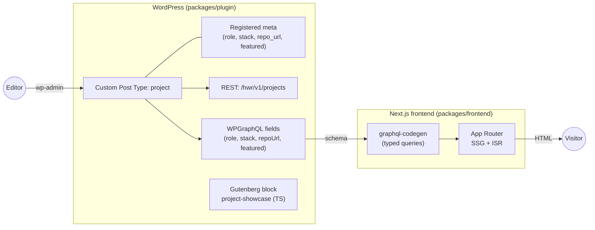

# Headless WordPress + React

[](https://github.com/lukecarva/headless-wp-react/actions/workflows/ci.yml)

A production shaped reference monorepo that decouples **WordPress** (content, editing, API) from a **React / Next.js** frontend. It is intentionally small in scope but complete in engineering practice: a custom plugin, a custom post type, REST and WPGraphQL surfaces, Gutenberg blocks authored in TypeScript, a typed GraphQL frontend, tests on both sides, CI, and documented architecture decisions.

The domain is a **project portfolio**. Editors manage `Project` entries in wp-admin, and the Next.js app renders them statically with incremental revalidation.

## Contents

- [Highlights](#highlights)
- [Architecture](#architecture)
- [Tech stack](#tech-stack)
- [Repository layout](#repository-layout)
- [Prerequisites](#prerequisites)
- [Quickstart](#quickstart)
- [Scripts](#scripts)
- [Environment variables](#environment-variables)
- [Testing](#testing)
- [Continuous integration](#continuous-integration)
- [Security posture](#security-posture)
- [Deployment](#deployment)
- [Architecture decisions](#architecture-decisions)
- [License](#license)

## Highlights

- **Decoupled by design.** WordPress serves only wp-admin and an API. The public site is a separate Next.js app.
- **One content model, two APIs.** Project fields are defined once and exposed through both WPGraphQL and a custom REST namespace, so the surfaces cannot drift.
- **Contract-checked GraphQL.** The frontend's WPGraphQL queries are validated against the live schema in CI via `graphql-codegen`; the app uses hand-authored types kept in sync with that schema.
- **Blocks in TypeScript.** The `project-showcase` Gutenberg block uses `block.json` (API v3) and renders dynamically in PHP.
- **Tested on both sides.** PHPUnit for the plugin, Vitest for units, Playwright for end to end.
- **Secure by default.** Per post capability checks, dedicated capabilities, a restrictive CORS policy, no raw SQL, and debug output disabled outside development.

## Architecture



Content is authored in WordPress and never rendered by its theme. The Next.js app reads it over WPGraphQL at build time and revalidates on an interval, so visitors are served static HTML and CDN assets. The rationale and trade-offs are documented in [docs/ARCHITECTURE.md](docs/ARCHITECTURE.md) and the [architecture decisions](#architecture-decisions).

## Tech stack

| Layer          | Choice                                                          |
| -------------- | --------------------------------------------------------------- |
| CMS / API      | WordPress 6.8, PHP 8.2, custom plugin (namespaced, PSR-4)       |
| Data access    | WPGraphQL (primary) and a custom REST namespace (`hwr/v1`)      |
| Editing        | Gutenberg block (`@wordpress/scripts`, `block.json` API v3, TS) |
| Frontend       | Next.js (App Router), React, TypeScript                         |
| GraphQL typing | `graphql-codegen`, validated against the live schema in CI      |
| Local env      | `@wordpress/env` (Docker), one command to boot WP and plugins   |
| Tests          | PHPUnit (plugin), Vitest (units), Playwright (e2e)              |
| Quality        | PHPCS (WordPress Coding Standards), PHPStan, ESLint, Prettier   |
| CI             | GitHub Actions, PHP and JS jobs plus a GraphQL contract job     |

## Repository layout

```
headless-wp-react/
├── packages/
│   ├── plugin/            # WordPress plugin (PHP + TS blocks)
│   │   ├── headless-portfolio.php   # bootstrap: autoload, activation, boot
│   │   ├── includes/                # PSR-4 classes (Hwr\Portfolio)
│   │   │   ├── Plugin.php            # wires features to hooks
│   │   │   ├── PostType/             # the project CPT and permalinks
│   │   │   ├── Meta/                 # single source of truth for fields
│   │   │   ├── Rest/                 # hwr/v1 controller (read + guarded write)
│   │   │   ├── GraphQL/              # WPGraphQL field registration
│   │   │   ├── Blocks/               # block registrar
│   │   │   ├── Capabilities.php      # dedicated project capabilities
│   │   │   ├── Cors.php              # restrictive CORS policy
│   │   │   └── I18n.php              # text domain loading
│   │   ├── src/blocks/               # Gutenberg block source (TypeScript)
│   │   ├── build/                    # compiled blocks (generated)
│   │   ├── tools/dev-mu-plugins/     # local-only demo seed
│   │   ├── tests/                    # PHPUnit
│   │   └── uninstall.php             # cleanup on delete
│   └── frontend/          # Next.js app (App Router, TS)
│       ├── app/           # routes (list, detail, revalidate webhook)
│       ├── components/    # ProjectCard, StackList
│       ├── lib/           # env, config, data-access, GraphQL client
│       └── tests/         # Vitest + Playwright
├── docs/                  # architecture and decisions (ADRs)
├── .wp-env.json           # local WordPress environment
└── .github/workflows/     # CI
```

Each package has its own README with the details that matter for that side: [packages/plugin/README.md](packages/plugin/README.md) and [packages/frontend/README.md](packages/frontend/README.md).

## Prerequisites

- **Node 20+** (CI uses 22) and **pnpm 9+**
- **Docker** (for `@wordpress/env`)
- **PHP 8.2+** and **Composer** (for the plugin's PHP dependencies and tests)

## Quickstart

```bash
# 1. Install JS dependencies across the workspace
pnpm install

# 2. Install PHP dependencies for the plugin
pnpm --filter @hwr/plugin composer:install

# 3. Boot WordPress, WPGraphQL, and this plugin (Docker)
pnpm env:start          # WordPress at http://localhost:8888 (admin/password)

# 4. Generate typed GraphQL and run the frontend
pnpm codegen
pnpm dev                # Next.js at http://localhost:3000
```

The local environment auto seeds a few demo `Project` entries on first boot (see `packages/plugin/tools/dev-mu-plugins/hwr-demo-seed.php`), so the frontend has data immediately. Manage projects in wp-admin under **Projects**.

## Scripts

Run from the repository root.

| Script              | Purpose                                     |
| ------------------- | ------------------------------------------- |
| `pnpm env:start`    | Boot the local WordPress environment        |
| `pnpm env:stop`     | Stop the environment                        |
| `pnpm env:destroy`  | Remove the environment and its data         |
| `pnpm dev`          | Run the Next.js dev server                  |
| `pnpm build`        | Build every package                         |
| `pnpm test`         | Run unit tests across the workspace         |
| `pnpm test:e2e`     | Run Playwright end to end tests             |
| `pnpm codegen`      | Generate typed GraphQL from the live schema |
| `pnpm lint`         | Lint every package                          |
| `pnpm typecheck`    | Type-check every package                    |
| `pnpm format`       | Format the repository with Prettier         |
| `pnpm format:check` | Check formatting without writing            |

## Environment variables

Copy `packages/frontend/.env.example` to `packages/frontend/.env.local`. The localhost defaults suit local development; real deployments must set the public variables explicitly.

| Variable                       | Purpose                                                   |
| ------------------------------ | --------------------------------------------------------- |
| `NEXT_PUBLIC_WORDPRESS_URL`    | WordPress base URL (admin links, image host allowlisting) |
| `NEXT_PUBLIC_GRAPHQL_ENDPOINT` | WPGraphQL endpoint the frontend queries                   |
| `REVALIDATE_SECONDS`           | ISR revalidation interval, in seconds                     |
| `REVALIDATE_SECRET`            | Shared secret for the on demand revalidation webhook      |

The plugin reads one optional constant, `HWR_FRONTEND_URL` (for example in `wp-config.php` or `.wp-env.json`), used to rewrite project permalinks to the frontend and to allowlist that origin for CORS.

## Testing

```bash
pnpm test                              # Vitest units (frontend)
pnpm test:e2e                          # Playwright (needs WordPress running)
pnpm --filter @hwr/plugin composer:install
```

PHP tests use the WordPress test framework and run through `wp-env`:

```bash
pnpm env:start
wp-env run tests-cli --env-cwd=wp-content/plugins/plugin ./vendor/bin/phpunit
```

## Continuous integration

GitHub Actions runs five jobs in [.github/workflows/ci.yml](.github/workflows/ci.yml):

- **php**: PHPCS (WordPress Coding Standards) and PHPStan.
- **php-tests**: boots WordPress with wp-env and runs PHPUnit against it.
- **js**: production dependency audit (`pnpm audit --prod --audit-level=high`), Prettier, ESLint, TypeScript, Vitest, and the production build.
- **graphql-contract**: boots WordPress and runs `graphql-codegen` against the live schema, so a query that references a field the schema no longer exposes fails the build.
- **e2e**: boots WordPress with wp-env and runs Playwright against the built frontend.

## Security posture

- **Authorization is server-side.** Writes check the `edit_post` capability for the specific project; the frontend is never trusted.
- **Dedicated capabilities.** The CPT uses `capability_type` and `map_meta_cap`, and only administrator and editor roles receive the project capabilities.
- **Restrictive CORS.** `Access-Control-Allow-Origin` is sent only for an allowlisted origin, and credentials are off by default.
- **No raw SQL.** All access goes through WordPress query APIs, enforced by PHPCS database sniffs.
- **Debug output is disabled** outside local and development environments.

See [docs/ARCHITECTURE.md](docs/ARCHITECTURE.md) for details.

## Deployment

- **WordPress** deploys to any managed host or container. Only wp-admin and the API are public.
- **Frontend** deploys to a static or Node host such as Vercel or Netlify. On save, the plugin's `Revalidator` calls `POST /api/revalidate` with the shared secret to revalidate on demand; set `HWR_REVALIDATE_SECRET` (WordPress) to match `REVALIDATE_SECRET` (frontend).

## Architecture decisions

- [0001 Headless architecture](docs/decisions/0001-headless-architecture.md)
- [0002 WPGraphQL primary, REST secondary](docs/decisions/0002-wpgraphql-primary-rest-secondary.md)
- [0003 Define the content model once](docs/decisions/0003-register-meta-once.md)
- [0004 TypeScript blocks with block.json v3](docs/decisions/0004-typescript-blocks-blockjson-v3.md)
- [0005 The project CPT is not rendered by WordPress](docs/decisions/0005-cpt-not-publicly-rendered.md)
- [0006 Dedicated project capabilities](docs/decisions/0006-dedicated-project-capabilities.md)
- [0007 Restrictive CORS](docs/decisions/0007-restrictive-cors.md)

## License

MIT. See [LICENSE](LICENSE).
