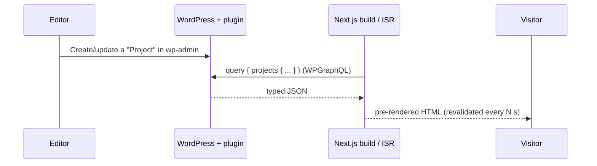

# Architecture

## Overview

The system is split into two independently deployable units connected only by an HTTP contract:

- **WordPress** owns content and editing. It is the source of truth and never renders the public site.
- **Next.js** owns presentation. It reads content over GraphQL at build time (and revalidates on an interval), so visitors are served static HTML/CDN assets.

## Content model

A single custom post type, `project`, with registered meta exposed to both REST and GraphQL:

| Field    | Key            | Type    | Notes                               |
| -------- | -------------- | ------- | ----------------------------------- |
| Role     | `hwr_role`     | string  | e.g. "Senior Full-stack"            |
| Stack    | `hwr_stack`    | string  | comma-separated; normalized on read |
| Repo URL | `hwr_repo_url` | string  | validated as URL                    |
| Featured | `hwr_featured` | boolean | drives ordering / hero placement    |

Meta is registered with `show_in_rest` and mirrored into WPGraphQL via `register_graphql_field`, so a single content definition serves both APIs. See [decisions/0003-register-meta-once.md](decisions/0003-register-meta-once.md).

## API surfaces

- **WPGraphQL** is the primary read surface for the frontend. It gives the frontend exactly the fields it needs in one round trip and, combined with `graphql-codegen`, end-to-end type safety.
- **REST** (`/wp-json/hwr/v1/projects`) exists for third parties / webhooks / no-GraphQL consumers and to demonstrate the classic WP REST path. It shares the same read model as GraphQL, and adds a capability-guarded write route (`POST /hwr/v1/projects/{id}/featured`).

## Authorization

Reads of published projects are public by design; drafts never leak (queries filter to `publish`, and WPGraphQL respects post status). Every **write** is authorized server-side and never trusts the client: the CPT uses dedicated capabilities granted only to administrator/editor (ADR 0006), and both the meta `auth_callback` and the REST write route check `edit_post` for the specific project (`map_meta_cap` resolves it to the project capabilities).

**CORS** is locked down (ADR 0007): WordPress core reflects any origin and sends `Access-Control-Allow-Credentials: true` by default, so `Hwr\Portfolio\Cors` replaces that. `Access-Control-Allow-Origin` is sent only for an allowlisted origin (the site and `HWR_FRONTEND_URL`), and credentials are off unless explicitly enabled. The frontend reads server-side, so it is unaffected, and arbitrary external browser frontends cannot call the API.

## Caching & revalidation

The frontend queries WPGraphQL over **HTTP GET**. This is deliberate: Next's Data Cache only caches GET fetches, so read queries are cached, revalidated on the ISR interval (`REVALIDATE_SECONDS`), and tagged (`wpgraphql`). A POST, which is graphql-request's default, would bypass the cache entirely. The frontend is read-only, so GET is sufficient (mutations would still need POST).

When a project is saved, the plugin (`Hwr\Portfolio\Revalidator`) `POST`s `/api/revalidate` with a shared secret to bust the `wpgraphql` tag, so updated content appears immediately instead of after the interval. The WordPress-side secret (`HWR_REVALIDATE_SECRET` constant or the `hwr_revalidate_secret` filter) must match the frontend's `REVALIDATE_SECRET`; when it is unset the ping is skipped.

## Boundaries

The frontend depends on the **shape of the GraphQL schema**, not on WordPress internals. That contract is enforced in CI: the `graphql-contract` job boots WordPress and runs `graphql-codegen` against the live WPGraphQL schema, which validates every query and fragment. If a query references a field the schema no longer exposes, the job fails before the change can merge.

The WP-less `js` job builds and type-checks against hand-authored types in `lib/graphql/types.ts` (so it needs no live CMS); the `graphql-contract` job is the guardrail that proves those queries still match the real schema and generates the fully typed operations (`lib/graphql/generated.ts`) plus a schema snapshot (`schema.graphql`).

## Local environment

`@wordpress/env` boots WordPress, WPGraphQL, and this plugin in Docker with a single command. The plugin directory is mounted, so PHP changes are live without a rebuild; block assets are built by `@wordpress/scripts`.

## Deployment shape (not included, but designed for)

- WordPress → any managed host (WP Engine, Kinsta) or container; only wp-admin and the API are public.
- Frontend → Vercel/Netlify/static host. Set `HWR_REVALIDATE_SECRET` (WordPress) to match `REVALIDATE_SECRET` (frontend) so `Hwr\Portfolio\Revalidator` can trigger on-demand revalidation on save (see Caching & revalidation).

## Production hardening

The debug flags in `.wp-env.json` are for the **local** environment only; no production configuration ships in this repo. When deploying WordPress:

- Set `WP_ENVIRONMENT_TYPE=production` and leave `WP_DEBUG`, `SCRIPT_DEBUG`, and `GRAPHQL_DEBUG` **off**.
- Keep `WP_DEBUG_DISPLAY` off so errors are never rendered into responses (they belong in a log). It is set to `false` even locally here as a habit.
- The plugin also forces WPGraphQL debug off outside `local`/`development` (`ProjectGraphQL::disable_debug_outside_dev`), so a stray `GRAPHQL_DEBUG` cannot leak traces in production.
- Disable WPGraphQL **public introspection** in production (WPGraphQL settings) if you do not want the API shape discoverable. This hides the GraphQL schema; it is never the database schema. The plugin issues no raw SQL and exposes no table names.

### Database access

All reads and writes go through WordPress query APIs (`WP_Query`, `get_post_meta`, `update_post_meta`) and WPGraphQL, which parameterize internally. There are no hand-written SQL statements, so there is nothing to inject into. This is enforced in CI: the PHPCS `WordPress.DB.PreparedSQL*` and `WordPress.DB.DirectDatabaseQuery` sniffs fail the build if any direct or unprepared query is introduced. Request inputs are also sanitized at the boundary (`absint`, boolean coercion, `sanitize_text_field`, `esc_url_raw`) before reaching any query argument.
